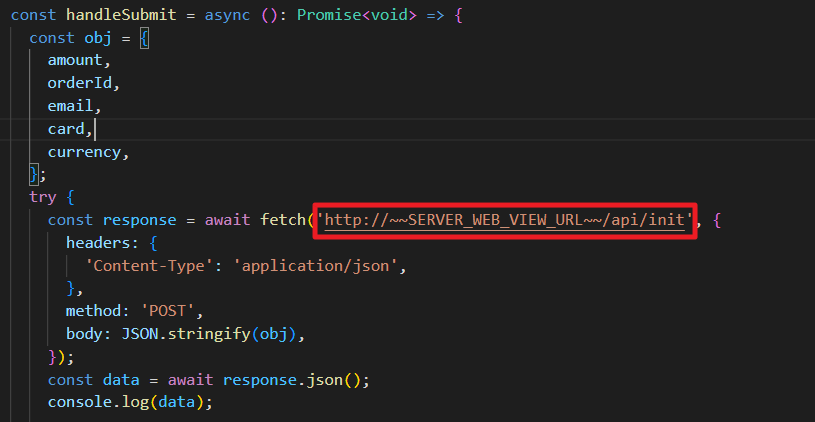

# [Webview-Redirect-ReactNative]

##  Índice
* [1. Introducción](#1-introducción)
* [2. Requisitos previos](#2-requisitos-previos)
* [3. Despliegue](#3-despliegue)
* [4. Datos de conexión](#4-datos-de-conexión)
* [5. Transacción de prueba](#5-transacción-de-prueba)
* [6. Implementación de la IPN](#6-implementación-de-la-ipn)
* [7. Personalización](#7-personalización)
* [8. Consideraciones](#8-consideraciones)
## 1. Introducción
En este manual podrás encontrar una guía paso a paso para configurar un proyecto de **[React Native]** con la pasarela de pagos de IZIPAY. Te proporcionaremos instrucciones detalladas y credenciales de prueba para la instalación y configuración del proyecto, permitiéndote trabajar y experimentar de manera segura en tu propio entorno local.
Este manual está diseñado para ayudarte a comprender el flujo de la integración de la pasarela para ayudarte a aprovechar al máximo tu proyecto y facilitar tu experiencia de desarrollo.

<p align="center">
  
</p>

<a name="Requisitos_Previos"></a>
 
## 2. Requisitos previos
* Comprender el flujo de comunicación de la pasarela. [Información Aquí](https://secure.micuentaweb.pe/doc/es-PE/rest/V4.0/javascript/guide/start.html)
* Extraer credenciales del Back Office Vendedor. [Guía Aquí](https://github.com/izipay-pe/obtener-credenciales-de-conexion)
* Para este proyecto utilizamos **Flutter 3.20.0**
* Ejecutar un servidor webview que genere el url de redirección. [Ejemplo Aquí](https://github.com/izipay-pe/Server-Webview-Java)
* Para este proyecto utilizamos la herramienta Android Studio.
> [!NOTE]
> Tener en cuenta que, para que el desarrollo de tu proyecto, eres libre de emplear tus herramientas preferidas.

## 3. Despliegue
### Clonar el proyecto:
  ```sh
  git clone [https://github.com/izipay-pe/Webview-Redirect-ReactNative.git]
  ```
### Instalar dependencias
```sh
npm install
```
### Dispositivo Virtual
Crear un dispositivo virtual desde Android Studio o puedes utilizar tu dispositivo físico.
<p align="center">
  
</p>

### Ejecutar proyecto en Android
Ejecutar el proyecto a través de la terminal de comandos de Visual Studio Code en la raiz del proyecto.
```sh
  npx react-native run-android
```

## 4. Datos de conexión 

**Nota**: Reemplace **[SERVER WEBVIEW URL]** con la url generada por su servidor webview, ver [Requisitos Previos](#Requisitos_Previos).

* Editar en `src/HomeScreen.tsx` :
<p align="center">
  
</p>

## 5. Transacción de prueba
Antes de poner en marcha su pasarela de pago en un entorno de producción, es esencial realizar pruebas para garantizar su correcto funcionamiento. 

Puede intentar realizar una transacción utilizando una tarjeta de prueba (en la parte inferior del formulario).

<p align="center">
  
</p>

* También puede encontrar tarjetas de prueba en el siguiente enlace. [Tarjetas de prueba](https://secure.micuentaweb.pe/doc/es-PE/rest/V4.0/api/kb/test_cards.html)
 
## 6. Implementación de la IPN
> [!IMPORTANT]
> Es recomendable implementar la IPN para comunicar el resultado de la solicitud de pago al servidor del comercio.

La IPN es una notificación de servidor a servidor (servidor de Izipay hacia el servidor del comercio) que facilita información en tiempo real y de manera automática cuando se produce un evento, por ejemplo, al registrar una transacción.
Los datos transmitidos en la IPN se reciben y analizan mediante un script que el vendedor habrá desarrollado en su servidor.
* Ver manual de implementación de la IPN. [Aquí]( https://secure.micuentaweb.pe/doc/es-PE/rest/V4.0/kb/payment_done.html)
* Vea el ejemplo de la respuesta IPN con JavaScript. [Aquí](https://github.com/izipay-pe/Server-IPN-JavaScript)
* Vea el ejemplo de la respuesta IPN con PHP. [Aquí](https://github.com/izipay-pe/Server-IPN-Php)

## 7. Personalización
Si deseas aplicar cambios específicos en la apariencia de la página de pago, puedes lograrlo mediante las opciones de personalización en el Backoffice. En este enlace [Personalización - Página de pago](https://youtu.be/hy877zTjpS0?si=TgSeoqw7qiaQDV25) podrá encontrar un video para guiarlo en la personalización.

## 8. Consideraciones
Para obtener más información, echa un vistazo a:
- [Formulario incrustado: prueba rápida](https://secure.micuentaweb.pe/doc/es-PE/rest/V4.0/javascript/quick_start_js.html)
- [Primeros pasos: pago simple](https://secure.micuentaweb.pe/doc/es-PE/rest/V4.0/javascript/guide/start.html)
- [Servicios web - referencia de la API REST](https://secure.micuentaweb.pe/doc/es-PE/rest/V4.0/api/reference.html)